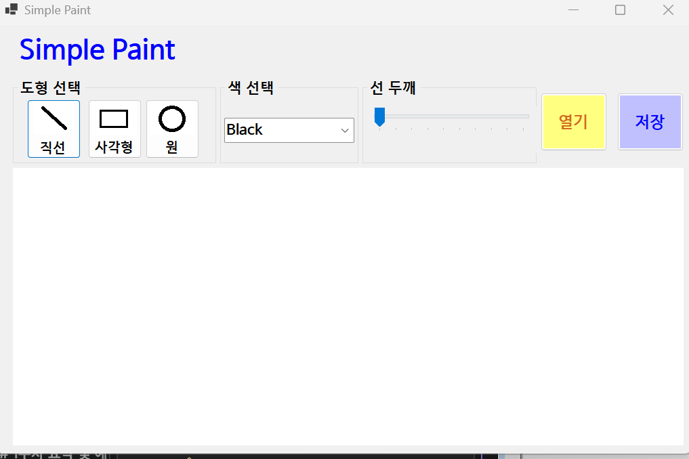
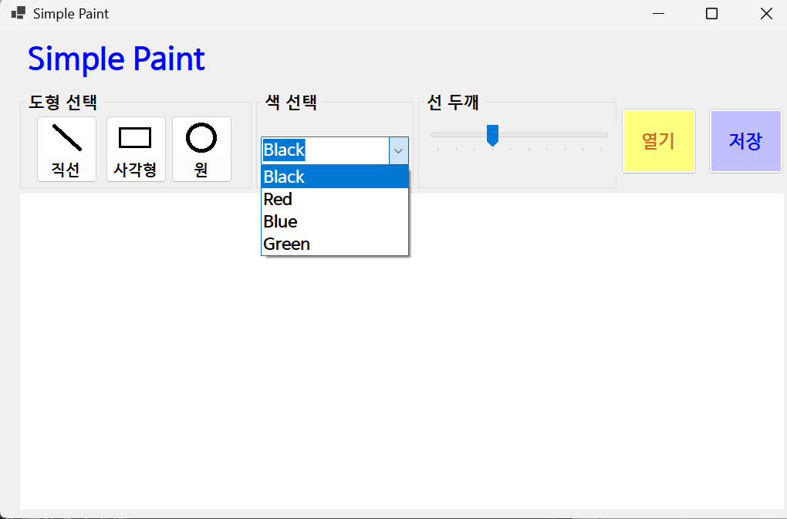
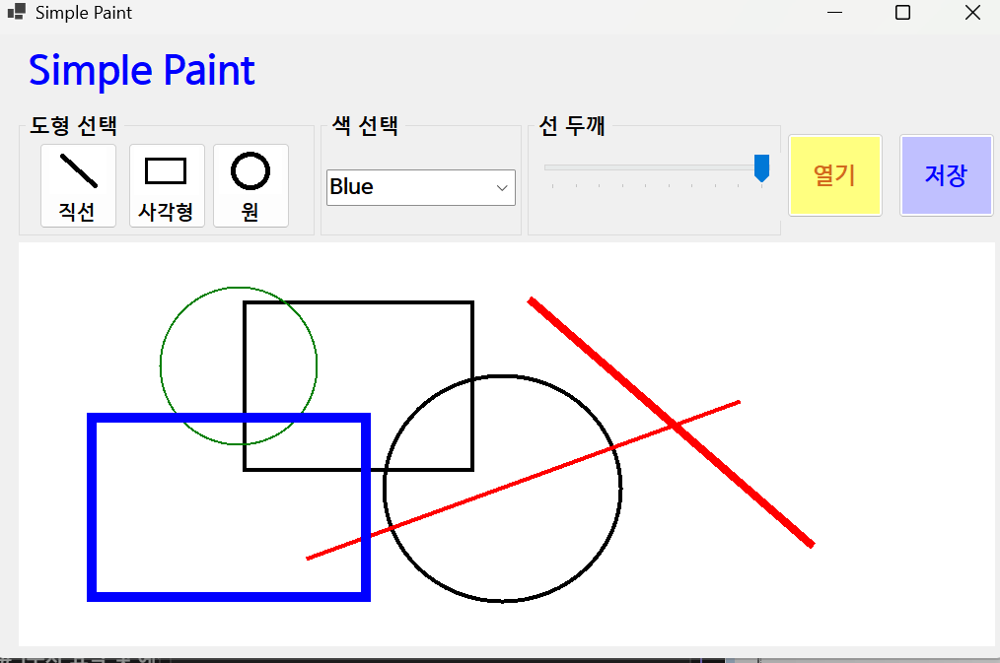
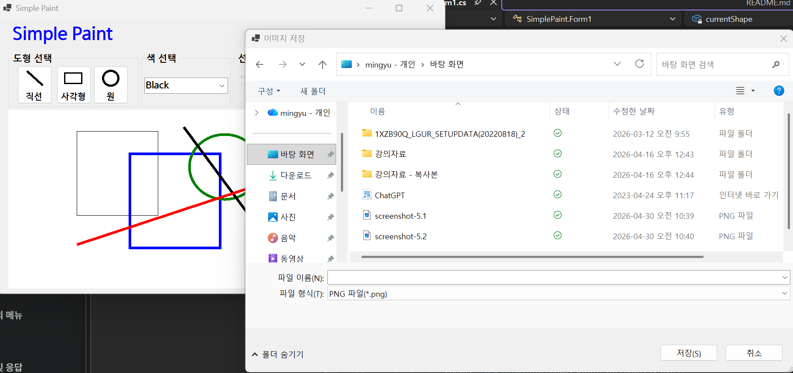
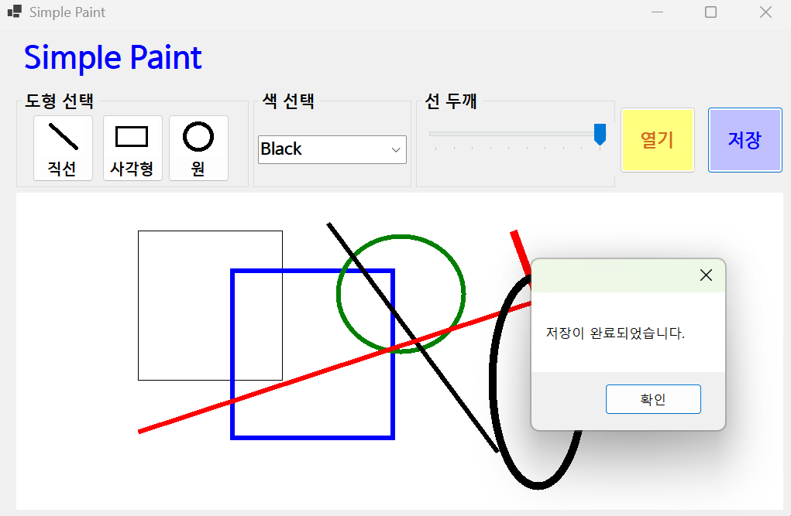
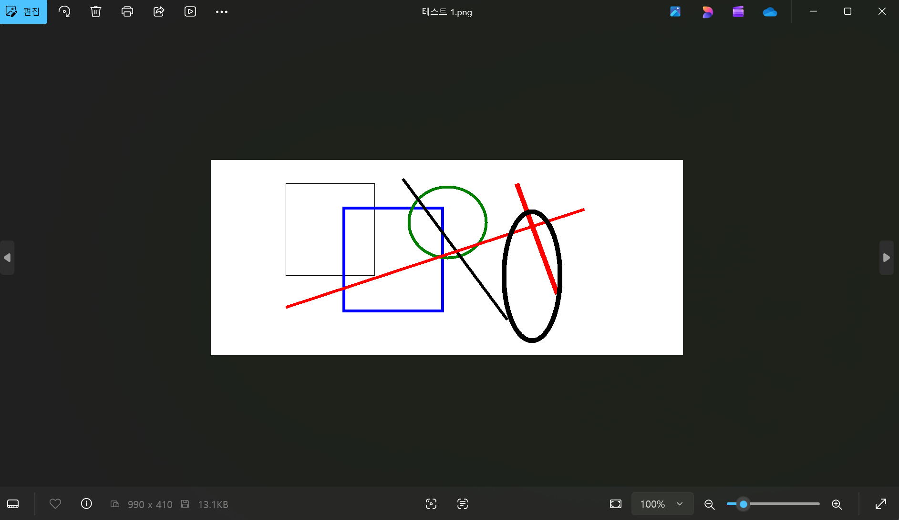
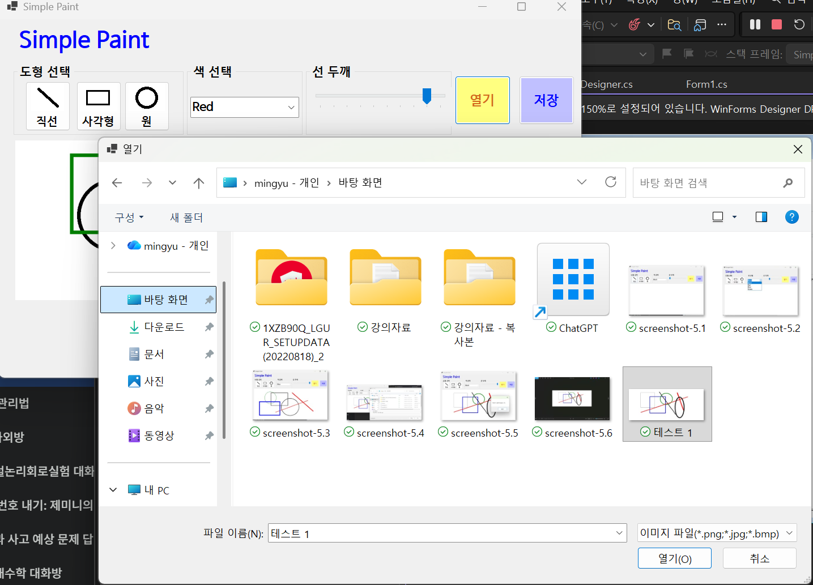
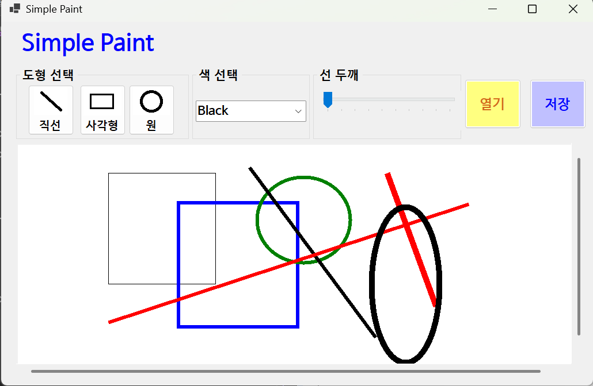
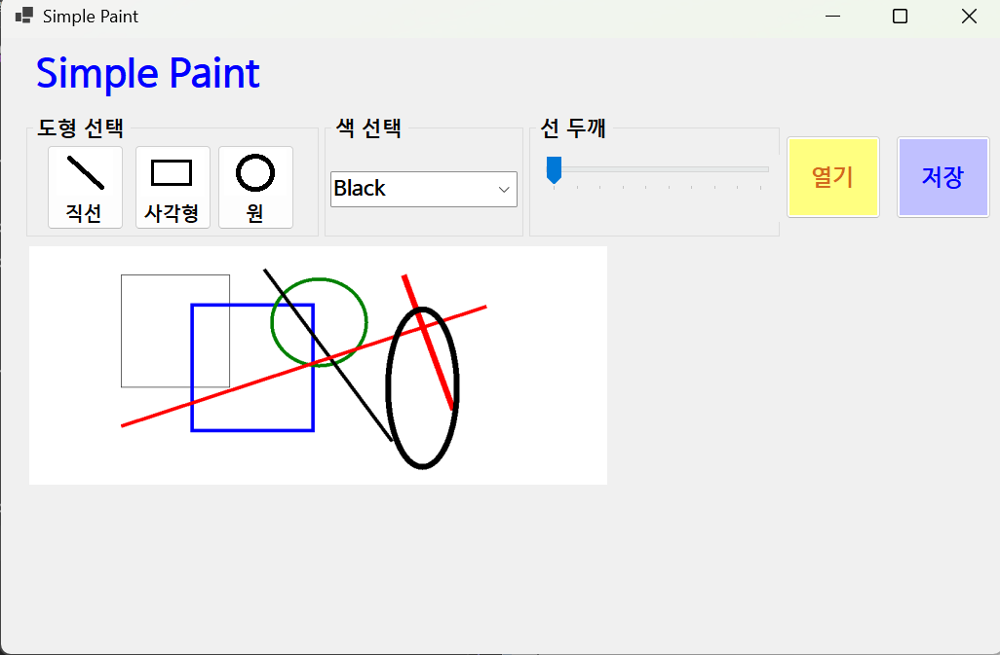

# (C# 코딩) SimplePaint

## 개요
-C# 프로그래밍 

### -1줄소개: 직선 사각형 원을 그릴 수 있는 그림판 프로그램

### -사용한플랫폼: C#, .NET Windows Forms, Visual Studio, GitHub

### -사용한컨트롤: Lable, button, comboBox, TrackBar, PictureBox, groupBox, Panel

### -사용한기술과구현한기능: 

 - Visual Studio를 이용하여 UI 디자인

 - string 클래스를이용한사용자입력데이터처리

 - GDI+ Drawing: Graphics, Pen, Bitmap 클래스를 이용한 동적 그래픽 구현

 - 더블 버퍼링 효과: Clone 비트맵을 이용한 그리기 중 잔상(Preview) 처리

 - 파일 입출력: SaveFileDialog/OpenFileDialog를 통한 이미지 저장 및 복구

 - 동적 레이아웃: 확대/축소 배율에 따른 PictureBox 크기 조정 및 스크롤바 연동

 - 이벤트 핸들링: 마우스 휠(Ctrl+Wheel) 및 마우스 드래그 이벤트 좌표 계산

 
### -수업중에배우고사용했던클래스들관련된설명

 - Bitmap: 메모리 상에 이미지 데이터를 저장하는 도화지 역할을 합니다.

 - Graphics: 실제 그림을 그리는 도구(붓을 든 손) 역할을 하며, Bitmap이나 컨트롤로부터 생성합니다.

 - Pen: 선의 색상, 굵기 등 스타일을 결정하는 클래스입니다.

 - Point: 화면의 X, Y 좌표를 저장하고 계산하는 데 사용됩니다.

 - ImageFormat: 저장 시 PNG, JPG, BMP 등 파일 형식을 지정하기 위해 사용합니다.

### -실습중에구현한기능들설명

 - 도형 그리기: 클릭-드래그를 통해 실시간으로 선, 사각형, 원을 그립니다.

 - 속성 변경: 콤보박스와 트랙바를 통해 선의 색상과 굵기를 즉시 변경합니다.

 - 이미지 관리: 작업 중인 내용을 파일로 저장하거나 외부 파일을 불러와 편집합니다.

 - 스마트 줌: Ctrl+휠을 사용하여 이미지를 확대/축소하며, 확대 시에도 정확한 좌표에 그려지도록 좌표 환산 로직을 포함합니다.

## 실행화면(과제1)

### -과제1코드의실행스크린샷

 

### -과제내용

1. 그림판의 기본 토대 마련: 마우스로 선을 그릴 수 있는 가장 기초적인 환경을 구축합니다.

2. 이벤트 핸들러 연결: 버튼을 클릭하거나 값을 바꿨을 때 코드가 실행될 수 있도록 디자인 창과 코드 창을 연결하는 기초 작업을 수행합니다.

3. 편리한 UI 구성: 콤보박스와 트랙바를 배치하여 누구나 쉽게 도구를 선택할 수 있게 만듭니다.

### -구현내용과기능설명

1.  도구 모음 구성: 도형 선택 버튼(선, 사각형, 원), 색상 선택창, 선 굵기 조절바를 배치하여 사용자가 기능을 한눈에 파악할 수 있도록 UI를 구성했습니다.

2. 이벤트 연결 준비: 각 버튼의 Click 이벤트와 콤보박스의 SelectedIndexChanged 이벤트를 생성하여, 사용자의 입력에 따라 프로그램이 즉각 반응할 수 있는 구조를 만들었습니다.

3. 도화지(Canvas) 초기화: 프로그램 시작 시 picCanvas의 크기에 맞는 비트맵을 생성하고 배경을 흰색으로 칠해, 그림을 그릴 준비가 된 깨끗한 상태를 화면에 출력합니다. 

### -사용한 기술과 구현한 기능

 - WinForms UI Layout: GroupBox, Panel 등을 활용한 사용자 친화적 화면 분할

 - Event Wire-up: 디자인 창과 소스 코드를 연결하여 사용자 명령(클릭, 값 변경)을 처리할 기반 마련

## -실행화면(과제2)

### -과제2코드의실행스크린샷

### -과제내용

1.  다양한 도형 추가: 직선, 사각형과 원까지 그릴 수 있도록 도구 상자를 확장합니다.

2. 그리기 옵션 설정: 사용자가 원하는 색상과 선의 굵기를 마음대로 바꿀 수 있는 기능을 추가합니다.

3. 마우스 이벤트 연결: 클릭(Down), 이동(Move), 떼기(Up)의 흐름을 코드로 제어하는 법을 익힙니다.

### -구현내용과기능설명

1. 도형 계산 알고리즘: 마우스를 어느 방향(대각선 위, 아래 등)으로 끌어도 사각형과 원이 예쁘게 그려지도록 좌표의 최소값과 절대값을 계산하는 로직을 적용했습니다.

2. 실시간 색상/굵기 반영: 콤보박스에서 고른 색상과 트랙바에서 조절한 수치가 즉시 펜(Pen)에 적용되어 그려지도록 연결했습니다.

3. 점선 미리보기(Preview) 기능: 마우스를 떼기 전, 어떤 모양으로 그려질지 점선으로 미리 보여주는 기능을 넣어 그리기 편의성을 높였습니다. 

4. 마우스 좌표 추적: 클릭한 순간의 위치를 시작점으로 잡고, 마우스를 뗄 때까지의 경로를 실시간으로 추적하여 선을 연결합니다.
 
### -사용한 기술과 구현한 기능

 - Math.Min과 Math.Abs를 활용한 도형 좌표 자동 보정

 - TrackBar와 ComboBox 값을 활용한 동적 펜(Pen) 설정
   

## -실행화면(과제3)

### -과제3코드의실행스크린샷

### -과제내용

1.  그림 저장하기: 정성껏 그린 그림을 이미지 파일(PNG, JPG 등)로 내 컴퓨터에 저장합니다.

2. 파일 대화상자 활용: 우리가 흔히 쓰는 '다른 이름으로 저장' 창을 띄워 저장 위치를 정할 수 있게 합니다.

3. 3가지 이상의 포맷 지원: PNG, JPG, BMP 등 다양한 이미지 형식으로 저장할 수 있도록 구현합니다.

### -구현내용과기능설명

1.  이미지 파일 생성: 메모리에만 있던 그림 데이터를 실제 파일로 변환하는 Save 기능을 구현했습니다.

2. 다양한 포맷 지원: 사용자가 저장할 때 정한 확장자에 맞춰서 자동으로 최적화된 파일 포맷으로 인코딩하여 저장합니다.

3. 3가지 이상의 포맷 지원: SaveFileDialog에서 선택한 확장자에 따라 ImageFormat을 자동으로 매핑하여 PNG, JPG, BMP 등 다양한 형식으로 저장할 수 있도록 했습니다.

### -사용한 기술과 구현한 기능

 - SaveFileDialog 컨트롤을 이용한 파일 저장 인터페이스

 - Bitmap.Save 메서드를 이용한 데이터 직렬화 및 저장

## -실행화면(과제4)

### -과제4코드의실행스크린샷

### -과제내용

1. 외부 이미지 불러오기: 저장해둔 사진이나 그림 파일을 불러와서 그 위에 다시 그림을 그릴 수 있게 합니다.

2. 자유로운 확대/축소: Ctrl + 마우스 휠을 사용하여 캔버스를 크게 보거나 작게 보는 줌 기능을 만듭니다.

3. 정밀한 그리기 보정: 화면을 확대하거나 축소한 상태에서도 마우스가 가리키는 정확한 위치에 그림이 그려지도록 계산합니다.

### -구현내용과기능설명

1. 스마트한 이미지 로드: 이미지를 불러올 때 원본 파일이 다른 프로그램에서 사용 중이어도 에러가 나지 않도록 메모리에 복사본을 만들어 안전하게 불러옵니다.

2. 배율 좌표 계산: 화면이 2배 커졌다면 마우스 좌표를 2로 나누어 실제 이미지의 위치를 찾아내는 '좌표 보정 로직'을 적용해 확대 상태에서도 정확한 그리기가 가능합니다.

3. 스크롤바 자동 생성: 이미지를 크게 확대하면 부모 패널에 자동으로 스크롤바가 생겨서 그림의 구석구석을 쉽게 이동하며 편집할 수 있습니다.

### -사용한 기술과 구현한 기능

 - 마우스 휠(MouseWheel) 감지 및 배율(zoomScale) 제어

 - StretchImage 모드를 이용한 성능 최적화 확대/축소 레이아웃 구축

